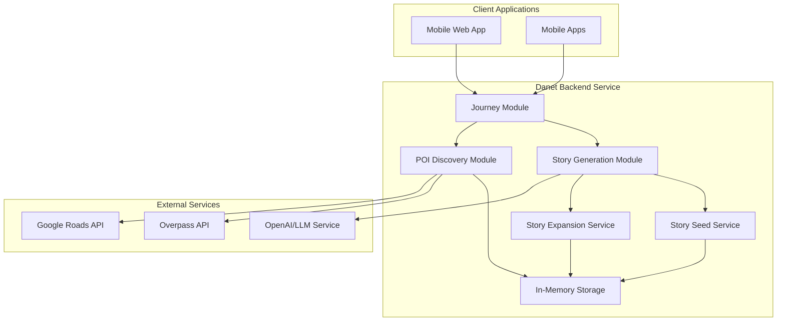
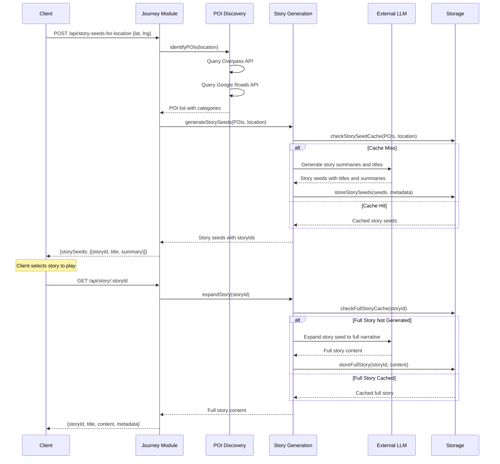

# Design Document

## Overview

The Jabberjaw backend provisional MVP is a Deno-based service that provides location-aware story generation for travel applications. It consists of three main modules: Story Generation, POI Discovery, and Journey. The system implements a two-phase story generation approach: first generating story seeds (summaries with titles), then expanding them into full stories on demand.

The architecture prioritizes rapid development, testability, and modularity while providing the core functionality needed to support both web and mobile clients. The MVP is considered complete when the journey service can successfully coordinate location processing and story seed generation, with full story expansion available through dedicated endpoints.

**Technology Stack:**

- **Runtime**: Deno 1.40+ with TypeScript
- **Framework**: Danet (Deno's NestJS-inspired framework)
- **Dependencies**: JSR (JavaScript Registry) imports only
- **Testing**: Deno's built-in testing framework with BDD support
- **Storage**: In-memory for MVP (persistent storage in enhancements)

## Architecture

### High-Level System Architecture



### Module Interaction Flow



## Components and Interfaces

### Journey Module

**Responsibilities:**

- Coordinate location processing workflow
- Manage client API endpoints for story seed discovery and story retrieval
- Handle request validation and response formatting
- Provide system health monitoring

**API Endpoints:**

```typescript
// Primary story seeds endpoint
POST /api/story-seeds-for-location
Request: {
  latitude: number;
  longitude: number;
  userId?: string; // Optional for future use
}
Response: {
  storySeeds: StorySeed[];
  location: LocationData;
  pois: PointOfInterest[];
  totalAvailable: number;
}

// Retrieve full story content
GET /api/story/:storyId
Response: {
  storyId: string;
  storyTitle: string;
  content: string;
  estimatedDuration: number;
  location: LocationData;
  pois: PointOfInterest[];
  generatedAt: Date;
}

// System health check
GET /api/health
Response: {
  status: "healthy" | "degraded" | "unhealthy";
  services: {
    storyGeneration: ServiceStatus;
    poiDiscovery: ServiceStatus;
    storage: ServiceStatus;
  };
  timestamp: Date;
}
```

**Service Interface:**

```typescript
@Injectable()
export class JourneyService {
  constructor(
    private poiService: POIDiscoveryService,
    private storyService: StoryGenerationService
  ) {}

  async generateStorySeedsForLocation(
    request: LocationRequest
  ): Promise<StorySeedsResponse> {
    // Coordinate POI discovery and story seed generation
  }

  async getStory(storyId: string): Promise<FullStory | null> {
    // Retrieve or generate full story content
  }

  getHealthStatus(): HealthStatus {
    // Aggregate service health information
  }
}
```

### Story Generation Module

**Responsibilities:**

- Generate story seeds (summaries and titles) using LLM integration
- Expand story seeds into full narratives on demand
- Manage story caching and storage with story seed persistence
- Handle both text and structured POI inputs
- Provide standalone testing endpoints

**API Endpoints:**

```typescript
// Generate story seeds from POI descriptions
POST /api/story/generate-seeds
Request: {
  description: string;
  location: LocationData;
} | {
  pois: StructuredPOI[];
  location: LocationData;
}
Response: {
  storySeeds: StorySeed[];
  generatedAt: Date;
}

// Generate full story from story seed
POST /api/story/expand/:storyId
Response: {
  storyId: string;
  storyTitle: string;
  content: string;
  estimatedDuration: number;
  generatedAt: Date;
}

// Retrieve story seed or full story
GET /api/story/:storyId
Response: {
  storyId: string;
  storyTitle: string;
  storySummary: string;
  content?: string; // Only present if full story has been generated
  location: LocationData;
  generatedAt: Date;
  estimatedDuration?: number;
}
```

**Service Architecture:**

```typescript
@Injectable()
export class StoryGenerationService {
  constructor(
    private llmService: LLMService,
    private storageService: StoryStorageService
  ) {}

  async generateStorySeeds(input: StoryInput): Promise<StorySeed[]> {
    // Generate story summaries and titles, store as seeds
  }

  async expandStory(storyId: string): Promise<FullStory> {
    // Expand story seed into full narrative content
  }

  async getStory(storyId: string): Promise<StorySeed | FullStory | null> {
    // Retrieve story seed or full story if available
  }
}

@Injectable()
export class LLMService {
  async generateStorySeeds(prompt: string): Promise<StorySeed[]> {
    // Generate multiple story summaries and titles
  }

  async expandStorySeed(storySeed: StorySeed): Promise<string> {
    // Expand story seed into full narrative
  }
}

@Injectable()
export class StoryStorageService {
  // In-memory storage for MVP
  private storySeedCache = new Map<string, StorySeed>();
  private fullStoryCache = new Map<string, FullStory>();

  async storeStorySeed(seed: StorySeed): Promise<void> {}
  async storeFullStory(storyId: string, content: string): Promise<void> {}
  async retrieveStorySeed(storyId: string): Promise<StorySeed | null> {}
  async retrieveFullStory(storyId: string): Promise<FullStory | null> {}
  async findStorySeedsByLocation(
    location: LocationData
  ): Promise<StorySeed[]> {}
}
```

### POI Discovery Module

**Responsibilities:**

- Identify points of interest near given coordinates
- Integrate with multiple POI data sources
- Categorize and rank discovered POIs
- Provide highway detection capabilities

**Service Interface:**

```typescript
@Injectable()
export class POIDiscoveryService {
  constructor(
    private overpassService: OverpassService,
    private googleRoadsService: GoogleRoadsService
  ) {}

  async identifyPOIs(location: LocationData): Promise<PointOfInterest[]> {
    // Discover and categorize POIs from multiple sources
  }

  async identifyHighways(location: LocationData): Promise<Highway[]> {
    // Detect nearby highways using multiple methods
  }
}

@Injectable()
export class OverpassService {
  async queryPOIs(
    location: LocationData,
    radius: number
  ): Promise<OverpassPOI[]> {
    // Query OpenStreetMap data via Overpass API
  }
}

@Injectable()
export class GoogleRoadsService {
  async snapToRoads(coordinates: LocationData[]): Promise<RoadInfo[]> {
    // Use Google Roads API for road identification
  }
}
```

## Data Models

### Core Location and POI Models

```typescript
interface LocationData {
  latitude: number;
  longitude: number;
  timestamp: Date;
  accuracy?: number;
}

interface PointOfInterest {
  id: string;
  name: string;
  category: POICategory;
  location: LocationData;
  description?: string;
  significance?: number;
  source: "overpass" | "google" | "manual";
}

enum POICategory {
  TOWN = "town",
  COUNTY = "county",
  NEIGHBORHOOD = "neighborhood",
  MAJOR_ROAD = "major_road",
  LANDMARK = "landmark",
  INSTITUTION = "institution",
  WATERWAY = "waterway",
  BRIDGE = "bridge",
  MOUNTAIN = "mountain",
  PARK = "park",
  // ... additional categories
}
```

### Story Generation Models

```typescript
interface StoryInput {
  type: "text" | "structured";
  data: string | StructuredPOI[];
  location: LocationData;
  context?: string;
}

interface StorySeed {
  storyId: string; // Surrogate key
  storyTitle: string; // LLM-generated title (part of natural key)
  storySummary: string; // Paragraph-long summary
  location: LocationData; // Location context (part of natural key)
  subject: string; // Subject matter (part of natural key)
  style?: string; // Content style (part of natural key)
  sources: string[];
  poiReferences: string[];
  generatedAt: Date;
}

interface FullStory extends StorySeed {
  content: string; // Full expanded narrative
  estimatedDuration: number;
  expandedAt: Date;
}

interface StoredStory {
  storySeed: StorySeed;
  fullStory?: string; // Only present if expanded
  prompt: string;
  pois: PointOfInterest[];
  // Future extension fields
  userId?: string;
  userRating?: number;
}
```

### Request/Response DTOs

```typescript
// Journey DTOs
export class LocationRequestDto {
  @IsNumber()
  latitude: number;

  @IsNumber()
  longitude: number;

  @IsOptional()
  @IsString()
  userId?: string;
}

export class StorySeedsResponseDto {
  storySeeds: StorySeed[];
  location: LocationData;
  pois: PointOfInterest[];
  totalAvailable: number;
}

export class FullStoryResponseDto {
  storyId: string;
  storyTitle: string;
  content: string;
  estimatedDuration: number;
  location: LocationData;
  pois: PointOfInterest[];
  generatedAt: Date;
}

// Story Generation DTOs
export class StoryGenerationRequestDto {
  @IsString()
  description?: string;

  @IsOptional()
  pois?: StructuredPOI[];

  @IsObject()
  location: LocationData;
}

export class StorySeedDto {
  storyId: string;
  storyTitle: string;
  storySummary: string;
  location: LocationData;
  generatedAt: Date;
}
```

## Error Handling Strategy

### Service-Level Error Handling

```typescript
@Injectable()
export class ErrorHandlingService {
  handleLLMError(error: Error): StorySeed[] {
    // Fallback to generic story seeds or cached alternatives
    return [
      {
        storyId: "fallback-story",
        storyTitle: "Local Area Information",
        storySummary:
          "I'm having trouble generating stories right now. Let me try again in a moment.",
        location: error.context?.location,
        subject: "fallback",
        sources: [],
        poiReferences: [],
        generatedAt: new Date(),
      },
    ];
  }

  handlePOIDiscoveryError(error: Error): PointOfInterest[] {
    // Return empty array or basic location-based POI
    return [];
  }

  handleStoryNotFoundError(storyId: string): void {
    // Handle cases where story seed doesn't exist
    throw new Error(`Story with ID ${storyId} not found`);
  }

  handleNetworkError(error: Error): void {
    // Log error and implement retry logic
  }
}
```

### HTTP Error Responses

```typescript
// Standard error response format
interface ErrorResponse {
  error: {
    code: string;
    message: string;
    details?: any;
  };
  timestamp: Date;
  path: string;
}

// Common error scenarios
export enum ErrorCodes {
  INVALID_LOCATION = "INVALID_LOCATION",
  LLM_SERVICE_UNAVAILABLE = "LLM_SERVICE_UNAVAILABLE",
  POI_DISCOVERY_FAILED = "POI_DISCOVERY_FAILED",
  STORY_NOT_FOUND = "STORY_NOT_FOUND",
  STORY_SEED_NOT_FOUND = "STORY_SEED_NOT_FOUND",
  STORY_EXPANSION_FAILED = "STORY_EXPANSION_FAILED",
  RATE_LIMIT_EXCEEDED = "RATE_LIMIT_EXCEEDED",
}
```

### Timeout and Retry Configuration

```typescript
interface ServiceConfig {
  llm: {
    timeout: 30000; // 30 seconds
    retries: 2;
    backoffMs: 1000;
  };
  poi: {
    timeout: 10000; // 10 seconds
    retries: 3;
    backoffMs: 500;
  };
  storage: {
    timeout: 5000; // 5 seconds
    retries: 1;
  };
}
```

## Testing Strategy

### Unit Testing Approach

```typescript
// Example service test structure
describe("StoryGenerationService", () => {
  let service: StoryGenerationService;
  let mockLLMService: MockLLMService;
  let mockStorageService: MockStoryStorageService;

  beforeEach(() => {
    mockLLMService = new MockLLMService();
    mockStorageService = new MockStoryStorageService();
    service = new StoryGenerationService(mockLLMService, mockStorageService);
  });

  it("should generate story seeds for text input", async () => {
    const input: StoryInput = {
      type: "text",
      data: "The town of Princeton, NJ",
      location: {
        latitude: 40.3573,
        longitude: -74.6672,
        timestamp: new Date(),
      },
    };

    const result = await service.generateStorySeeds(input);

    assertEquals(Array.isArray(result), true);
    assertEquals(result.length > 0, true);
    assertEquals(typeof result[0].storyTitle, "string");
    assertEquals(typeof result[0].storySummary, "string");
  });

  it("should expand story seed to full story", async () => {
    const storyId = "test-story-id";
    const result = await service.expandStory(storyId);

    assertEquals(typeof result.content, "string");
    assertEquals(result.estimatedDuration > 0, true);
  });

  it("should use cached story seeds when available", async () => {
    // Test story seed caching behavior
  });

  it("should use cached full story when available", async () => {
    // Test full story caching behavior
  });
});
```

### Integration Testing

```typescript
// E2E test for journey endpoints
describe("Journey API", () => {
  let app: DanetApplication;

  beforeAll(async () => {
    app = new DanetApplication();
    await app.init(AppModule);
    await app.listen(3001);
  });

  it("should process location and return story seeds", async () => {
    const response = await fetch(
      "http://localhost:3001/api/story-seeds-for-location",
      {
        method: "POST",
        headers: { "Content-Type": "application/json" },
        body: JSON.stringify({
          latitude: 40.3573,
          longitude: -74.6672,
        }),
      }
    );

    assertEquals(response.status, 200);
    const data = await response.json();
    assertEquals(Array.isArray(data.storySeeds), true);
    assertEquals(data.storySeeds.length > 0, true);
    assertEquals(typeof data.storySeeds[0].storyId, "string");
    assertEquals(typeof data.storySeeds[0].storyTitle, "string");
    assertEquals(typeof data.storySeeds[0].storySummary, "string");
  });

  it("should retrieve full story content", async () => {
    // First generate story seeds
    const seedsResponse = await fetch(
      "http://localhost:3001/api/story-seeds-for-location",
      {
        method: "POST",
        headers: { "Content-Type": "application/json" },
        body: JSON.stringify({
          latitude: 40.3573,
          longitude: -74.6672,
        }),
      }
    );
    const seedsData = await seedsResponse.json();
    const storyId = seedsData.storySeeds[0].storyId;

    // Then retrieve full story
    const storyResponse = await fetch(
      `http://localhost:3001/api/story/${storyId}`
    );
    assertEquals(storyResponse.status, 200);
    const storyData = await storyResponse.json();
    assertEquals(typeof storyData.storyId, "string");
    assertEquals(typeof storyData.content, "string");
    assertEquals(typeof storyData.estimatedDuration, "number");
  });
});
```

### Mock Services for Testing

```typescript
@Injectable()
export class MockLLMService implements LLMService {
  async generateStorySeeds(prompt: string): Promise<StorySeed[]> {
    // Return deterministic mock story seeds for testing
    return [
      {
        storyId: "mock-story-1",
        storyTitle: "Historic Town Center",
        storySummary: `Mock story summary for: ${prompt.substring(0, 30)}...`,
        location: {
          latitude: 40.3573,
          longitude: -74.6672,
          timestamp: new Date(),
        },
        subject: "history",
        sources: ["mock"],
        poiReferences: ["test-poi-1"],
        generatedAt: new Date(),
      },
    ];
  }

  async expandStorySeed(storySeed: StorySeed): Promise<string> {
    return `Mock expanded narrative for "${storySeed.storyTitle}": ${storySeed.storySummary} This is the full story content that would be generated by the LLM service.`;
  }
}

@Injectable()
export class MockPOIDiscoveryService implements POIDiscoveryService {
  async identifyPOIs(location: LocationData): Promise<PointOfInterest[]> {
    // Return predictable test POIs
    return [
      {
        id: "test-poi-1",
        name: "Test Location",
        category: POICategory.TOWN,
        location,
        source: "manual",
      },
    ];
  }
}
```

## Development Environment Setup

### Deno Configuration (deno.json)

```json
{
  "tasks": {
    "dev": "deno run --allow-net --allow-env --allow-read --watch src/main.ts",
    "start": "deno run --allow-net --allow-env --allow-read src/main.ts",
    "test": "deno test --allow-net --allow-env --allow-read",
    "test:unit": "deno test --allow-net --allow-env --allow-read src/**/*.test.ts",
    "test:e2e": "deno test --allow-net --allow-env --allow-read test/**/*.test.ts",
    "lint": "deno lint",
    "fmt": "deno fmt",
    "fmt:check": "deno fmt --check"
  },
  "imports": {
    "@danet/core": "jsr:@danet/core@^2.0.0",
    "@std/assert": "jsr:@std/assert@^1.0.0",
    "@std/testing": "jsr:@std/testing@^1.0.0",
    "@std/http": "jsr:@std/http@^1.0.0",
    "@std/dotenv": "jsr:@std/dotenv@^0.225.0"
  },
  "lint": {
    "rules": {
      "tags": ["recommended"]
    }
  },
  "fmt": {
    "useTabs": false,
    "lineWidth": 100,
    "indentWidth": 2,
    "semiColons": true,
    "singleQuote": true
  },
  "compilerOptions": {
    "allowJs": true,
    "lib": ["deno.window"],
    "strict": true,
    "experimentalDecorators": true,
    "emitDecoratorMetadata": true
  }
}
```

### Environment Configuration

```typescript
// Environment variables
interface EnvironmentConfig {
  PORT: number;
  OPENAI_API_KEY: string;
  OPENAI_MODEL: string;
  GOOGLE_ROADS_API_KEY?: string;
  LOG_LEVEL: "debug" | "info" | "warn" | "error";
  CACHE_TTL_MINUTES: number;
}

// Configuration service
@Injectable()
export class ConfigService {
  private config: EnvironmentConfig;

  constructor() {
    this.config = {
      PORT: Number(Deno.env.get("PORT")) || 3000,
      OPENAI_API_KEY: Deno.env.get("OPENAI_API_KEY") || "",
      OPENAI_MODEL: Deno.env.get("OPENAI_MODEL") || "gpt-3.5-turbo",
      GOOGLE_ROADS_API_KEY: Deno.env.get("GOOGLE_ROADS_API_KEY"),
      LOG_LEVEL: (Deno.env.get("LOG_LEVEL") as any) || "info",
      CACHE_TTL_MINUTES: Number(Deno.env.get("CACHE_TTL_MINUTES")) || 60,
    };
  }

  get<K extends keyof EnvironmentConfig>(key: K): EnvironmentConfig[K] {
    return this.config[key];
  }
}
```

## Deployment Considerations

### MVP Deployment Strategy

For the provisional MVP, the focus is on simplicity and rapid iteration:

- **Single Service Deployment**: All modules in one Deno process
- **In-Memory Storage**: No external database dependencies
- **Environment-Based Configuration**: Simple .env file configuration
- **Health Check Endpoints**: Basic monitoring capabilities
- **CORS Configuration**: Support for web client testing

### Performance Considerations

- **Story Seed Caching**: Aggressive caching of story seeds to minimize LLM API calls for initial discovery
- **Full Story Caching**: Cache expanded stories to avoid re-generation on subsequent requests
- **Request Deduplication**: Avoid duplicate story seed generation for same location and context
- **Lazy Story Expansion**: Only generate full story content when specifically requested
- **Timeout Management**: Reasonable timeouts for external services (story seed generation vs full story expansion)
- **Memory Management**: Monitor in-memory cache size for both story seeds and full stories, implement cleanup

### Security Considerations

- **API Key Management**: Secure handling of external service credentials
- **Input Validation**: Comprehensive validation of all API inputs
- **Rate Limiting**: Basic rate limiting to prevent abuse
- **CORS Policy**: Restrictive CORS policy for production deployment
- **Error Information**: Avoid exposing sensitive information in error responses

This design provides a solid foundation for the backend provisional MVP with the new story-based approach, implementing two-phase content generation while maintaining flexibility for future enhancements and mobile app integration. The story seed and expansion methodology allows for efficient content discovery and on-demand generation, supporting better user experience and resource management.
