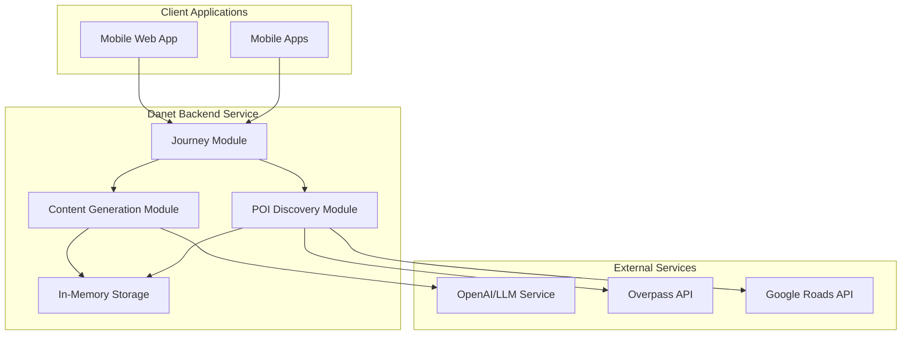
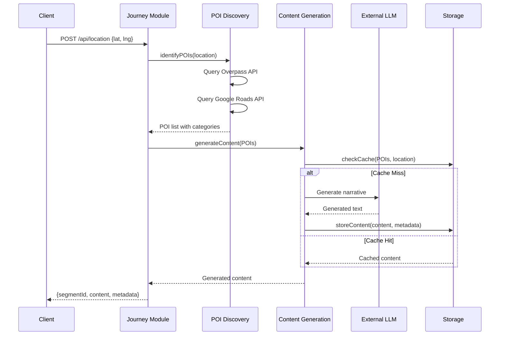

# Design Document

## Overview

The Jabberjaw backend provisional MVP is a Deno-based service that provides location-aware content generation for travel applications. It consists of three main modules: Content Generation, POI Discovery, and Journey. The system is designed to be a first cut at the backend requirements, with the understanding that changes will be needed once mobile app development begins.

The architecture prioritizes rapid development, testability, and modularity while providing the core functionality needed to support both web and mobile clients. The MVP is considered complete when the journey service can successfully coordinate location processing and content generation.

**Technology Stack:**

- **Runtime**: Deno 1.40+ with TypeScript
- **Framework**: Danet (Deno's NestJS-inspired framework)
- **Dependencies**: JSR (JavaScript Registry) imports only
- **Testing**: Deno's built-in testing framework with BDD support
- **Storage**: In-memory for MVP (persistent storage in enhancements)

## Architecture

### High-Level System Architecture



### Module Interaction Flow



## Components and Interfaces

### Journey Module

**Responsibilities:**

- Coordinate location processing workflow
- Manage client API endpoints
- Handle request validation and response formatting
- Provide system health monitoring

**API Endpoints:**

```typescript
// Primary journey endpoint
POST /api/location
Request: {
  latitude: number;
  longitude: number;
  userId?: string; // Optional for future use
}
Response: {
  segmentId: string;
  content: string;
  estimatedDuration: number;
  location: LocationData;
  pois: PointOfInterest[];
}

// Retrieve specific content segment
GET /api/segment/:id
Response: {
  id: string;
  content: string;
  location: LocationData;
  pois: PointOfInterest[];
  generatedAt: Date;
  estimatedDuration: number;
}

// System health check
GET /api/health
Response: {
  status: "healthy" | "degraded" | "unhealthy";
  services: {
    contentGeneration: ServiceStatus;
    poiDiscovery: ServiceStatus;
    storage: ServiceStatus;
  };
  timestamp: Date;
}
```

**Service Interface:**

```typescript
@Injectable()
export class JourneyService {
  constructor(
    private poiService: POIDiscoveryService,
    private contentService: ContentGenerationService
  ) {}

  async processLocation(request: LocationRequest): Promise<ContentSegment> {
    // Coordinate POI discovery and content generation
  }

  async getSegment(segmentId: string): Promise<ContentSegment | null> {
    // Retrieve stored content segment
  }

  getHealthStatus(): HealthStatus {
    // Aggregate service health information
  }
}
```

### Content Generation Module

**Responsibilities:**

- Generate travel narratives using LLM integration
- Manage content caching and storage
- Handle both text and structured POI inputs
- Provide standalone testing endpoints

**API Endpoints:**

```typescript
// Generate content from POI descriptions
POST /api/content/generate
Request: {
  description: string;
} | {
  poi: StructuredPOI;
}
Response: {
  id: string;
  content: string;
  estimatedDuration: number;
  generatedAt: Date;
}

// Retrieve generated content
GET /api/content/:id
Response: {
  id: string;
  content: string;
  prompt: string;
  generatedAt: Date;
  estimatedDuration: number;
}
```

**Service Architecture:**

```typescript
@Injectable()
export class ContentGenerationService {
  constructor(
    private llmService: LLMService,
    private storageService: ContentStorageService
  ) {}

  async generateContent(input: ContentInput): Promise<GeneratedContent> {
    // Check cache, generate if needed, store result
  }
}

@Injectable()
export class LLMService {
  async generateNarrative(prompt: string): Promise<string> {
    // OpenAI API integration with fallback to mock
  }
}

@Injectable()
export class ContentStorageService {
  // In-memory storage for MVP
  private contentCache = new Map<string, StoredContent>();

  async store(content: StoredContent): Promise<void> {}
  async retrieve(id: string): Promise<StoredContent | null> {}
  async findByLocation(location: LocationData): Promise<StoredContent[]> {}
}
```

### POI Discovery Module

**Responsibilities:**

- Identify points of interest near given coordinates
- Integrate with multiple POI data sources
- Categorize and rank discovered POIs
- Provide highway detection capabilities

**Service Interface:**

```typescript
@Injectable()
export class POIDiscoveryService {
  constructor(
    private overpassService: OverpassService,
    private googleRoadsService: GoogleRoadsService
  ) {}

  async identifyPOIs(location: LocationData): Promise<PointOfInterest[]> {
    // Discover and categorize POIs from multiple sources
  }

  async identifyHighways(location: LocationData): Promise<Highway[]> {
    // Detect nearby highways using multiple methods
  }
}

@Injectable()
export class OverpassService {
  async queryPOIs(
    location: LocationData,
    radius: number
  ): Promise<OverpassPOI[]> {
    // Query OpenStreetMap data via Overpass API
  }
}

@Injectable()
export class GoogleRoadsService {
  async snapToRoads(coordinates: LocationData[]): Promise<RoadInfo[]> {
    // Use Google Roads API for road identification
  }
}
```

## Data Models

### Core Location and POI Models

```typescript
interface LocationData {
  latitude: number;
  longitude: number;
  timestamp: Date;
  accuracy?: number;
}

interface PointOfInterest {
  id: string;
  name: string;
  category: POICategory;
  location: LocationData;
  description?: string;
  significance?: number;
  source: "overpass" | "google" | "manual";
}

enum POICategory {
  TOWN = "town",
  COUNTY = "county",
  NEIGHBORHOOD = "neighborhood",
  MAJOR_ROAD = "major_road",
  LANDMARK = "landmark",
  INSTITUTION = "institution",
  WATERWAY = "waterway",
  BRIDGE = "bridge",
  MOUNTAIN = "mountain",
  PARK = "park",
  // ... additional categories
}
```

### Content Generation Models

```typescript
interface ContentInput {
  type: "text" | "structured";
  data: string | StructuredPOI;
  location: LocationData;
  context?: string;
}

interface GeneratedContent {
  id: string;
  content: string;
  estimatedDuration: number;
  sources: string[];
  poiReferences: string[];
  generatedAt: Date;
}

interface StoredContent extends GeneratedContent {
  prompt: string;
  location: LocationData;
  pois: PointOfInterest[];
  // Future extension fields
  userId?: string;
  userRating?: number;
}
```

### Request/Response DTOs

```typescript
// Journey DTOs
export class LocationRequestDto {
  @IsNumber()
  latitude: number;

  @IsNumber()
  longitude: number;

  @IsOptional()
  @IsString()
  userId?: string;
}

export class ContentSegmentDto {
  segmentId: string;
  content: string;
  estimatedDuration: number;
  location: LocationData;
  pois: PointOfInterest[];
  generatedAt: Date;
}

// Content Generation DTOs
export class ContentGenerationRequestDto {
  @IsString()
  description?: string;

  @IsOptional()
  poi?: StructuredPOI;
}
```

## Error Handling Strategy

### Service-Level Error Handling

```typescript
@Injectable()
export class ErrorHandlingService {
  handleLLMError(error: Error): string {
    // Fallback to generic content or cached alternatives
    return "I'm having trouble generating content right now. Let me try again in a moment.";
  }

  handlePOIDiscoveryError(error: Error): PointOfInterest[] {
    // Return empty array or basic location-based POI
    return [];
  }

  handleNetworkError(error: Error): void {
    // Log error and implement retry logic
  }
}
```

### HTTP Error Responses

```typescript
// Standard error response format
interface ErrorResponse {
  error: {
    code: string;
    message: string;
    details?: any;
  };
  timestamp: Date;
  path: string;
}

// Common error scenarios
export enum ErrorCodes {
  INVALID_LOCATION = "INVALID_LOCATION",
  LLM_SERVICE_UNAVAILABLE = "LLM_SERVICE_UNAVAILABLE",
  POI_DISCOVERY_FAILED = "POI_DISCOVERY_FAILED",
  CONTENT_NOT_FOUND = "CONTENT_NOT_FOUND",
  RATE_LIMIT_EXCEEDED = "RATE_LIMIT_EXCEEDED",
}
```

### Timeout and Retry Configuration

```typescript
interface ServiceConfig {
  llm: {
    timeout: 30000; // 30 seconds
    retries: 2;
    backoffMs: 1000;
  };
  poi: {
    timeout: 10000; // 10 seconds
    retries: 3;
    backoffMs: 500;
  };
  storage: {
    timeout: 5000; // 5 seconds
    retries: 1;
  };
}
```

## Testing Strategy

### Unit Testing Approach

```typescript
// Example service test structure
describe("ContentGenerationService", () => {
  let service: ContentGenerationService;
  let mockLLMService: MockLLMService;
  let mockStorageService: MockContentStorageService;

  beforeEach(() => {
    mockLLMService = new MockLLMService();
    mockStorageService = new MockContentStorageService();
    service = new ContentGenerationService(mockLLMService, mockStorageService);
  });

  it("should generate content for text input", async () => {
    const input: ContentInput = {
      type: "text",
      data: "The town of Princeton, NJ",
      location: {
        latitude: 40.3573,
        longitude: -74.6672,
        timestamp: new Date(),
      },
    };

    const result = await service.generateContent(input);

    assertEquals(typeof result.content, "string");
    assertEquals(result.estimatedDuration > 0, true);
  });

  it("should use cached content when available", async () => {
    // Test caching behavior
  });
});
```

### Integration Testing

```typescript
// E2E test for journey endpoint
describe("Journey API", () => {
  let app: DanetApplication;

  beforeAll(async () => {
    app = new DanetApplication();
    await app.init(AppModule);
    await app.listen(3001);
  });

  it("should process location and return content segment", async () => {
    const response = await fetch("http://localhost:3001/api/location", {
      method: "POST",
      headers: { "Content-Type": "application/json" },
      body: JSON.stringify({
        latitude: 40.3573,
        longitude: -74.6672,
      }),
    });

    assertEquals(response.status, 200);
    const data = await response.json();
    assertEquals(typeof data.segmentId, "string");
    assertEquals(typeof data.content, "string");
  });
});
```

### Mock Services for Testing

```typescript
@Injectable()
export class MockLLMService implements LLMService {
  async generateNarrative(prompt: string): Promise<string> {
    // Return deterministic mock content for testing
    return `Mock narrative content for: ${prompt.substring(0, 50)}...`;
  }
}

@Injectable()
export class MockPOIDiscoveryService implements POIDiscoveryService {
  async identifyPOIs(location: LocationData): Promise<PointOfInterest[]> {
    // Return predictable test POIs
    return [
      {
        id: "test-poi-1",
        name: "Test Location",
        category: POICategory.TOWN,
        location,
        source: "manual",
      },
    ];
  }
}
```

## Development Environment Setup

### Deno Configuration (deno.json)

```json
{
  "tasks": {
    "dev": "deno run --allow-net --allow-env --allow-read --watch src/main.ts",
    "start": "deno run --allow-net --allow-env --allow-read src/main.ts",
    "test": "deno test --allow-net --allow-env --allow-read",
    "test:unit": "deno test --allow-net --allow-env --allow-read src/**/*.test.ts",
    "test:e2e": "deno test --allow-net --allow-env --allow-read test/**/*.test.ts",
    "lint": "deno lint",
    "fmt": "deno fmt",
    "fmt:check": "deno fmt --check"
  },
  "imports": {
    "@danet/core": "jsr:@danet/core@^2.0.0",
    "@std/assert": "jsr:@std/assert@^1.0.0",
    "@std/testing": "jsr:@std/testing@^1.0.0",
    "@std/http": "jsr:@std/http@^1.0.0",
    "@std/dotenv": "jsr:@std/dotenv@^0.225.0"
  },
  "lint": {
    "rules": {
      "tags": ["recommended"]
    }
  },
  "fmt": {
    "useTabs": false,
    "lineWidth": 100,
    "indentWidth": 2,
    "semiColons": true,
    "singleQuote": true
  },
  "compilerOptions": {
    "allowJs": true,
    "lib": ["deno.window"],
    "strict": true,
    "experimentalDecorators": true,
    "emitDecoratorMetadata": true
  }
}
```

### Environment Configuration

```typescript
// Environment variables
interface EnvironmentConfig {
  PORT: number;
  OPENAI_API_KEY: string;
  OPENAI_MODEL: string;
  GOOGLE_ROADS_API_KEY?: string;
  LOG_LEVEL: "debug" | "info" | "warn" | "error";
  CACHE_TTL_MINUTES: number;
}

// Configuration service
@Injectable()
export class ConfigService {
  private config: EnvironmentConfig;

  constructor() {
    this.config = {
      PORT: Number(Deno.env.get("PORT")) || 3000,
      OPENAI_API_KEY: Deno.env.get("OPENAI_API_KEY") || "",
      OPENAI_MODEL: Deno.env.get("OPENAI_MODEL") || "gpt-3.5-turbo",
      GOOGLE_ROADS_API_KEY: Deno.env.get("GOOGLE_ROADS_API_KEY"),
      LOG_LEVEL: (Deno.env.get("LOG_LEVEL") as any) || "info",
      CACHE_TTL_MINUTES: Number(Deno.env.get("CACHE_TTL_MINUTES")) || 60,
    };
  }

  get<K extends keyof EnvironmentConfig>(key: K): EnvironmentConfig[K] {
    return this.config[key];
  }
}
```

## Deployment Considerations

### MVP Deployment Strategy

For the provisional MVP, the focus is on simplicity and rapid iteration:

- **Single Service Deployment**: All modules in one Deno process
- **In-Memory Storage**: No external database dependencies
- **Environment-Based Configuration**: Simple .env file configuration
- **Health Check Endpoints**: Basic monitoring capabilities
- **CORS Configuration**: Support for web client testing

### Performance Considerations

- **Content Caching**: Aggressive caching to minimize LLM API calls
- **Request Deduplication**: Avoid duplicate requests for same location
- **Timeout Management**: Reasonable timeouts for external services
- **Memory Management**: Monitor in-memory cache size and implement cleanup

### Security Considerations

- **API Key Management**: Secure handling of external service credentials
- **Input Validation**: Comprehensive validation of all API inputs
- **Rate Limiting**: Basic rate limiting to prevent abuse
- **CORS Policy**: Restrictive CORS policy for production deployment
- **Error Information**: Avoid exposing sensitive information in error responses

This design provides a solid foundation for the backend provisional MVP while maintaining flexibility for future enhancements and mobile app integration.
