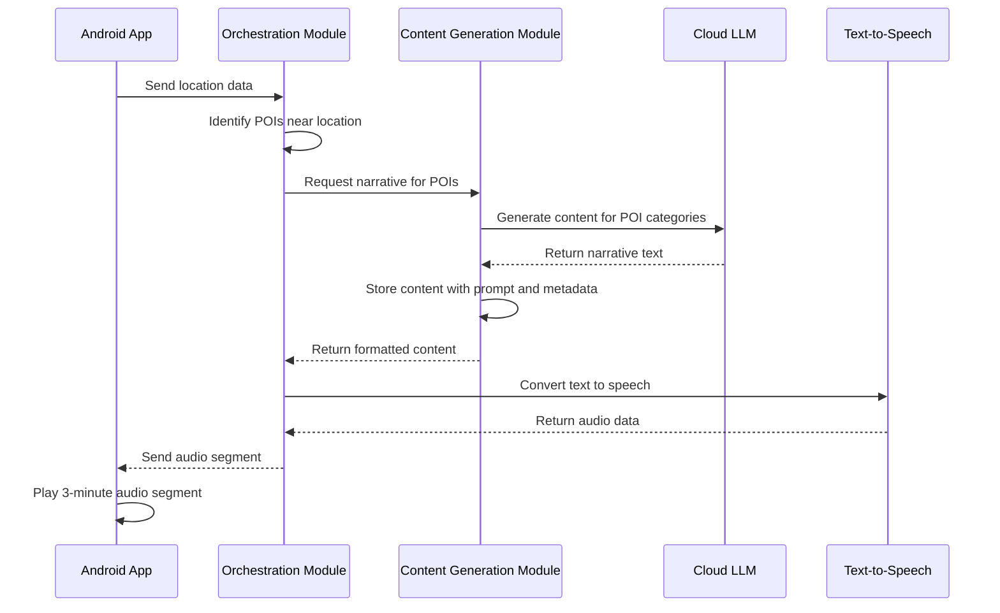

# Design Document

## Overview

The Road Trip Narrator system consists of three main components: an Android mobile application, a backend content generation service, and a backend orchestration service. The mobile app handles location tracking, audio playback, and user interface, while the backend services manage point-of-interest identification, content generation using LLMs, and system coordination. The architecture prioritizes modularity, scalability, offline capability, and content persistence.

**Technology Stack:**
- **Backend Runtime**: Deno with TypeScript (native support, built-in tooling)
- **Backend Framework**: Danet (Deno's equivalent to NestJS)
- **Dependency Management**: JSR (JavaScript Registry) for all imports
- **Mobile Platform**: Android (native development)

**User-Agnostic Design:** The initial implementation has no concept of users or authentication. All content generation is anonymous and location-based. However, the data models and architecture are designed to easily accommodate future user features through optional fields and extensible schemas without requiring major architectural changes.

## Architecture

### High-Level Architecture

```mermaid
graph TB
    A[Android App] --> B[Danet Backend Application]
    
    subgraph "Danet Backend Application (Deno Runtime)"
        B --> C[Orchestration Module]
        B --> D[Content Generation Module]
        B --> H[Data Storage Module]
        C --> D
        C --> H
        D --> H
    end
    
    B --> E[Points of Interest API]
    D --> F[Cloud LLM Service]
    B --> G[Text-to-Speech Service]
    
    subgraph "External Services"
        E
        F
        G
    end
    
    subgraph "JSR Dependencies"
        I[@std/assert]
        J[@std/testing]
        K[@std/http]
        L[@std/dotenv]
        M[@danet/core]
    end
    
    B -.-> I
    B -.-> J
    B -.-> K
    B -.-> L
    B -.-> M
```

### System Flow



## Components and Interfaces

### Android Mobile Application

**Core Components:**
- `LocationTracker`: Manages GPS location services and location change detection
- `AudioPlayer`: Handles text-to-speech playback and audio session management
- `ContentManager`: Coordinates with backend services and manages content caching
- `UserInterface`: Provides start/stop controls and status feedback

**Key Interfaces:**
```typescript
interface LocationData {
  latitude: number;
  longitude: number;
  timestamp: Date;
  accuracy: number;
}

interface AudioSegment {
  id: string;
  content: string;
  duration: number;
  location: LocationData;
  audioUrl?: string;
}

interface AppState {
  isActive: boolean;
  currentLocation: LocationData | null;
  currentSegment: AudioSegment | null;
  connectionStatus: 'online' | 'offline';
}
```

### Backend Danet Application

The backend is a single Danet application running on Deno containing two main modules that work together:

**Deno/Danet Architecture Benefits:**
- **Zero Configuration**: No package.json or node_modules - dependencies managed via JSR imports
- **Built-in Tooling**: Native TypeScript support, testing, formatting, and linting
- **Security**: Explicit permissions for file system, network, and environment access
- **Performance**: Faster startup times and better resource usage
- **Modern Standards**: ES modules, top-level await, and Web APIs

**JSR Import Strategy:**
All dependencies are imported from JSR (JavaScript Registry) for consistency and reliability:
- `@danet/core`: Main framework for dependency injection and decorators
- `@std/assert`: Testing assertions
- `@std/testing`: Testing framework with BDD support
- `@std/http`: HTTP utilities and server functionality
- `@std/dotenv`: Environment variable management

#### Orchestration Module

**Responsibilities:**
- Coordinate location processing and POI identification
- Manage content generation requests and caching
- Handle text-to-speech conversion
- Provide RESTful API endpoints for mobile app
- Orchestrate calls to the Content Generation Module

**Key Endpoints:**
```typescript
POST /api/location
  Body: { latitude: number, longitude: number }
  Response: { segmentId: string, audioUrl: string }

GET /api/segment/:id
  Response: { content: string, audioUrl: string, duration: number }

GET /api/health
  Response: { status: string, services: ServiceStatus[] }
```

#### Content Generation Module

**Responsibilities:**
- Process POI data and categorize locations
- Generate narrative content using LLM integration
- Store generated content with associated prompts for analysis and reuse
- Format and structure content for audio delivery
- Provide internal services consumed by the Orchestration Module

#### Data Storage Module

**Responsibilities:**
- Store generated content with prompts, metadata, and location data
- Provide content retrieval and caching capabilities
- Support future user-based features through extensible schema design
- Manage content lifecycle and cleanup policies

**Content Categories:**
- Geographic features (towns, counties, waterways, mountains, valleys, plateaus)
- Infrastructure (roads, bridges, landmarks, airports, train stations, rest stops)
- Institutions (schools, government buildings, historical sites, museums, libraries)
- Natural areas (parks, forests, recreational areas, wildlife refuges, scenic overlooks)
- Cultural sites (theaters, music venues, art installations, cultural centers)
- Religious sites (churches, temples, monasteries, pilgrimage sites)
- Industrial heritage (factories, mills, mining sites, agricultural facilities)
- Sports and recreation (stadiums, race tracks, golf courses, ski resorts)
- Military sites (bases, battlefields, memorials, forts)
- Transportation history (historic routes, canals, railroad heritage)
- Geological features (caves, rock formations, mineral sites, fault lines)
- Agricultural landmarks (farms, vineyards, orchards, farmers markets)

**Content Types:**
- Historical facts and founding stories
- Notable people and their connections
- Name origins and etymology
- Significant events and cultural importance
- Geographic and geological information

## Data Models

### Point of Interest Model
```typescript
interface PointOfInterest {
  id: string;
  name: string;
  category: POICategory;
  location: {
    latitude: number;
    longitude: number;
  };
  description: string;
  metadata: {
    population?: number;
    foundedYear?: number;
    elevation?: number;
    significance: string[];
  };
}

enum POICategory {
  TOWN = 'town',
  COUNTY = 'county',
  NEIGHBORHOOD = 'neighborhood',
  MAJOR_ROAD = 'major_road',
  LANDMARK = 'landmark',
  INSTITUTION = 'institution',
  WATERWAY = 'waterway',
  BRIDGE = 'bridge',
  MOUNTAIN = 'mountain',
  PARK = 'park',
  VALLEY = 'valley',
  PLATEAU = 'plateau',
  AIRPORT = 'airport',
  TRAIN_STATION = 'train_station',
  REST_STOP = 'rest_stop',
  MUSEUM = 'museum',
  LIBRARY = 'library',
  CULTURAL_CENTER = 'cultural_center',
  THEATER = 'theater',
  MUSIC_VENUE = 'music_venue',
  ART_INSTALLATION = 'art_installation',
  RELIGIOUS_SITE = 'religious_site',
  CHURCH = 'church',
  TEMPLE = 'temple',
  MONASTERY = 'monastery',
  PILGRIMAGE_SITE = 'pilgrimage_site',
  FACTORY = 'factory',
  MILL = 'mill',
  MINING_SITE = 'mining_site',
  AGRICULTURAL_FACILITY = 'agricultural_facility',
  STADIUM = 'stadium',
  RACE_TRACK = 'race_track',
  GOLF_COURSE = 'golf_course',
  SKI_RESORT = 'ski_resort',
  MILITARY_BASE = 'military_base',
  BATTLEFIELD = 'battlefield',
  MEMORIAL = 'memorial',
  FORT = 'fort',
  HISTORIC_ROUTE = 'historic_route',
  CANAL = 'canal',
  RAILROAD_HERITAGE = 'railroad_heritage',
  CAVE = 'cave',
  ROCK_FORMATION = 'rock_formation',
  MINERAL_SITE = 'mineral_site',
  FAULT_LINE = 'fault_line',
  FARM = 'farm',
  VINEYARD = 'vineyard',
  ORCHARD = 'orchard',
  FARMERS_MARKET = 'farmers_market',
  WILDLIFE_REFUGE = 'wildlife_refuge',
  SCENIC_OVERLOOK = 'scenic_overlook'
}
```

### Content Generation Model
```typescript
interface ContentRequest {
  pois: PointOfInterest[];
  userLocation: LocationData;
  previousSegments: string[];
  targetDuration: number; // in seconds
}

interface GeneratedContent {
  id: string;
  narrative: string;
  estimatedDuration: number;
  sources: string[];
  poiReferences: string[];
  prompt: string;
  generatedAt: Date;
  location: LocationData;
}

interface StoredContent {
  id: string;
  narrative: string;
  prompt: string;
  pois: PointOfInterest[];
  location: LocationData;
  estimatedDuration: number;
  sources: string[];
  poiReferences: string[];
  generatedAt: Date;
  audioUrl?: string;
  // Future user extension fields
  userId?: string; // Optional for future user support
  userRating?: number; // Optional for future feedback
  userTags?: string[]; // Optional for future personalization
}
```

## Error Handling

### Network Connectivity
- Implement exponential backoff for API requests
- Cache generated content locally on mobile device
- Provide user feedback for connectivity status
- Gracefully degrade to cached content when offline

### Location Services
- Handle location permission denials with user guidance
- Implement fallback for low-accuracy GPS readings
- Detect when location services are disabled
- Provide manual location input as backup option

### Content Generation Failures
- Implement retry logic with circuit breaker pattern
- Maintain fallback content for common geographic areas
- Log generation failures for system monitoring
- Provide generic content when specific generation fails

### Audio Playback Issues
- Handle text-to-speech service unavailability
- Implement audio format compatibility checks
- Manage audio focus and interruptions (calls, notifications)
- Provide visual content display as fallback

## Development Workflow

### Deno Development Environment

**Prerequisites:**
- Deno 1.40+ installed (https://deno.land/manual/getting_started/installation)
- No additional package managers or build tools required

**Development Commands:**
```bash
# Start development server with hot reload
deno task dev

# Run all tests
deno task test

# Run unit tests only
deno task test:unit

# Run e2e tests only
deno task test:e2e

# Format code
deno task fmt

# Lint code
deno task lint

# Start production server
deno task start
```

**Dependency Management:**
- All dependencies are managed through JSR imports in `deno.json`
- No installation step required - Deno downloads and caches dependencies automatically
- Use `deno add jsr:@package/name` to add new dependencies
- Dependencies are version-pinned and cached globally

**Testing Framework:**
- Uses Deno's built-in testing framework with BDD support
- Unit tests: `*.test.ts` files alongside source code
- E2E tests: `test/*.test.ts` files for integration testing
- No external testing dependencies required

## Testing Strategy

### Unit Testing (Deno Built-in)
- Test location calculation and POI identification algorithms using `@std/assert`
- Validate content generation prompt engineering with BDD-style tests
- Test service dependency injection and module initialization
- Verify error handling and retry mechanisms with mock implementations

**Example Test Structure:**
```typescript
import { assertEquals } from '@std/assert';
import { describe, it, beforeEach } from '@std/testing/bdd';
import { AppService } from './app.service.ts';

describe('AppService', () => {
  let service: AppService;
  
  beforeEach(() => {
    service = new AppService();
  });
  
  it('should generate health status', () => {
    const health = service.getHealth();
    assertEquals(health.runtime, 'Deno');
  });
});
```

### Integration Testing (Danet Application Testing)
- Test end-to-end content generation pipeline with real Danet application
- Validate HTTP endpoints using native fetch API
- Test module integration and dependency resolution
- Verify service orchestration and data flow

**Example E2E Test:**
```typescript
import { assertEquals } from '@std/assert';
import { DanetApplication } from '@danet/core';
import { AppModule } from '../src/app.module.ts';

describe('API Integration', () => {
  let app: DanetApplication;
  
  beforeAll(async () => {
    app = new DanetApplication();
    await app.init(AppModule);
    await app.listen(3001);
  });
  
  it('should return health status', async () => {
    const response = await fetch('http://localhost:3001/health');
    const json = await response.json();
    assertEquals(response.status, 200);
  });
});
```

### Performance Testing
- Load test backend services with concurrent requests using Deno's built-in benchmarking
- Test mobile app battery usage during extended use
- Validate content generation response times with Deno's performance APIs
- Test memory usage and caching efficiency with Deno's resource monitoring

### User Acceptance Testing
- Test real-world driving scenarios with GPS tracking
- Validate content quality and relevance
- Test user interface responsiveness and controls
- Verify audio quality and volume levels during driving